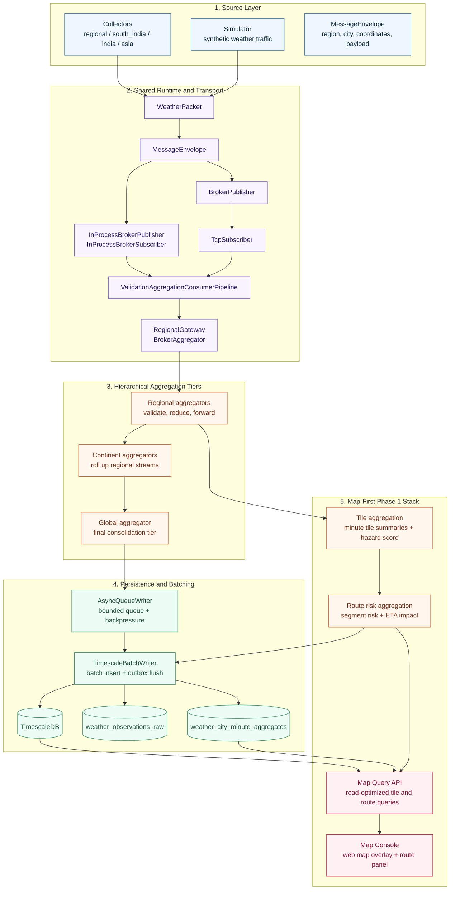

# Architecture & Design Overview

This document explains how Weather RTOS actually runs: how messages move through the hierarchy, where concurrency exists, which mutexes protect which state, and why the Timescale schema is split into raw and aggregate tables.

## System Shape

The repository is organized around a pipeline:

Collectors -> hierarchical aggregators -> Timescale writer

## Architecture Diagram

Use the following Mermaid diagram to show the repository in a structured, end-to-end view. It includes the core runtime pipeline, shared transport and validation layers, persistence, and the phase 1 map stack.



The default demo launches one OS process per component instance. Inside each process, the code keeps concurrency narrow and explicit: a few dedicated threads handle polling, socket I/O, queue draining, and batching instead of a large shared worker pool.

The main entry points are:

- [collectors/regional/main.cpp](collectors/regional/main.cpp)
- [aggregator/hierarchical/main.cpp](aggregator/hierarchical/main.cpp)
- [timescale_writer/main.cpp](timescale_writer/main.cpp)

Shared support lives under [common/](common/), especially [common/pipeline/ValidationAggregationConsumerPipeline.hpp](common/pipeline/ValidationAggregationConsumerPipeline.hpp), [common/subscribing/TcpSubscriber.hpp](common/subscribing/TcpSubscriber.hpp), [common/subscribing/InProcessBrokerSubscriber.hpp](common/subscribing/InProcessBrokerSubscriber.hpp), and [common/timescale/AsyncQueueWriter.hpp](common/timescale/AsyncQueueWriter.hpp).

## Message Flow

The normal data path is:

1. A collector samples weather data for a city.
2. The collector wraps that payload in a MessageEnvelope and publishes it to the region topic.
3. The regional or hierarchical aggregator receives the envelope, validates it, and forwards it upward.
4. The writer receives the envelope, batches it, and writes both a raw record and a minute-level aggregate into TimescaleDB.

Two details matter here:

- The transport and the business logic are intentionally separated. TcpSubscriber only receives bytes, turns them into MessageEnvelope objects, and hands them off.
- The pipeline does not mutate shared application state except for its own counters and summary statistics.

## Why There Are Two Timescale Tables

The schema in [timescale/schema.sql](timescale/schema.sql) uses both:

- [weather_observations_raw](timescale/schema.sql#L3) for full-fidelity event history
- [weather_city_minute_aggregates](timescale/schema.sql#L24) for minute-bucket rollups

Scaffolding: We provide a Timescale continuous-aggregate scaffold at [timescale/migrations/007_continuous_aggregates.sql](timescale/migrations/007_continuous_aggregates.sql) and a helper script at [tools/create_continuous_agg.sh](tools/create_continuous_agg.sh) for applying it. Use [timescale/tests/verify_continuous_agg.sql](timescale/tests/verify_continuous_agg.sql) to smoke-check results after the view materializes.

That split is deliberate.

`weather_observations_raw` is the source of truth. It stores every observation with its exact event time, ingestion time, source, ingestion layer, sample point, location fields, temperature, humidity, wind speed, and full payload JSON. It is indexed by `message_id` for deduplication and turned into a hypertable on `event_time` so time-range reads stay efficient.

`weather_city_minute_aggregates` is a read-optimized summary table. It keeps one row per minute bucket and location. That makes dashboard-style queries and per-city rollups much cheaper than scanning raw data every time.

The writer inserts into both tables in the same batch transaction. You can see that in [common/timescale/TimescaleBatchWriter.hpp](common/timescale/TimescaleBatchWriter.hpp). The raw insert preserves history; the aggregate insert gives fast access to minute-level statistics.

Important nuance: as currently implemented, the aggregate upsert merges `min_temperature` and `max_temperature`, but `avg_temperature`, `avg_humidity`, `avg_wind_speed`, and `observation_count` are written from the latest batch contribution for that bucket. That is fine if the table is treated as a per-batch rollup cache, but it is not a full running aggregate model.

## Component Roles

### Collectors

The regional collector in [collectors/regional/main.cpp](collectors/regional/main.cpp) has two kinds of threads:

- One polling thread per city
- One sender thread that drains the queue and publishes envelopes

Each poll thread fetches weather data, builds a WeatherPacket, and pushes it into a shared `std::queue` guarded by `queueMutex` and coordinated with `queueCv`.

The sender thread also uses `queueMutex` and `queueCv` to pop packets, convert them into MessageEnvelope objects, and publish them to the next hop.

The main thread mostly stays alive by joining the worker threads.

### Hierarchical Aggregators

The hierarchical aggregator in [aggregator/hierarchical/main.cpp](aggregator/hierarchical/main.cpp) is simpler: it resolves its role from topology config, builds a consumer pipeline, and runs a TcpSubscriber on the current thread.

The important threading behavior is inside [common/subscribing/TcpSubscriber.hpp](common/subscribing/TcpSubscriber.hpp):

- The accept loop runs on the calling thread.
- Each accepted client connection gets its own receive thread.
- Each receive thread reads frames, parses a MessageEnvelope, and then either calls the pipeline directly or forwards to another broker topic.

This keeps blocking socket reads away from the main accept loop and avoids coupling client traffic together.

### Pipeline and Validation

The consumer pipeline in [common/pipeline/ValidationAggregationConsumerPipeline.hpp](common/pipeline/ValidationAggregationConsumerPipeline.hpp) does four things in order:

1. Deserialize the envelope into a WeatherPacket.
2. Validate required fields and ranges.
3. Record local statistics.
4. Log the envelope and call the downstream success callback.

The mutex in this class protects its counters and aggregates:

- `totalPackets_`
- `packetsByCity_`
- `temperatureSum_`

The lock is held only around the bookkeeping updates and summary calculation, not around file I/O or downstream callbacks. That keeps the critical section small.

### In-Process Broker

[common/subscribing/InProcessBrokerSubscriber.hpp](common/subscribing/InProcessBrokerSubscriber.hpp) models a simple topic queue for local development and testing.

Its synchronization is per-topic:

- A registry mutex protects lazy creation of the static maps.
- Each topic has its own queue mutex.
- Publishers push to the topic queue and notify the topic condition variable.
- The subscriber loops over its assigned topics, pops from whichever queue has data, and then hands the envelope to the pipeline.

This lets the repository run in-process demos without bringing in Kafka or another external broker.

### Timescale Writer

The writer in [timescale_writer/main.cpp](timescale_writer/main.cpp) uses a split-thread model:

- A subscriber thread receives TCP messages and feeds the async queue
- The main thread runs the queue processor and flush loop
- The underlying batch writer runs in its own thread

[common/timescale/AsyncQueueWriter.hpp](common/timescale/AsyncQueueWriter.hpp) is the key concurrency layer here. It uses:

- `queueMutex_` to protect the region-partitioned in-memory queues
- `cv_` to wake the dequeue loop when new work arrives
- `running` as the shutdown flag shared across threads
- atomics in `Metrics` so queue depth, backpressure, and flush statistics can be updated without additional locks

The queue is bounded, so submit is non-blocking: if the queue is full, the caller gets backpressure immediately instead of blocking the producer thread.

The writer also preserves region grouping by partitioning queued envelopes by region before batching. That helps keep ordering stable for related messages while still draining efficiently.

## Shutdown Model

Most long-running processes use the same pattern:

- Register SIGINT and SIGTERM handlers.
- Flip a shared `std::atomic<bool> running` to false.
- Let each worker loop observe the flag and exit cleanly.
- Join the worker threads before returning from main.

This is used in the collector, aggregator, and writer entry points. The result is predictable shutdown without forcing abrupt thread termination.

## Blocking And I/O

The design tries to isolate blocking work:

- Network reads happen on socket-specific threads.
- Weather polling happens on per-city threads.
- Database writes happen in batches.
- Logging is append-only and intentionally simple.

The main rule is: do not hold a mutex while doing blocking I/O or expensive work unless the critical section is tiny and unavoidable.

## Logging And Diagnostics

The default demo routes stdout and stderr into the `logs/` directory. See [demo.sh](demo.sh) and [logs/rotate.sh](logs/rotate.sh).

The consumer pipeline also appends the raw envelope JSON to a per-consumer log file under `LOGDIR` if that environment variable is set, otherwise `logs/`.

These logs are meant for local inspection and demo tracing. They are not a replacement for structured production telemetry.

## Operational Notes

- The topology is configuration-driven through [configs/global_topology.json](configs/global_topology.json).
- TcpSubscriber can either feed a pipeline directly or forward to a broker topic, which keeps the same transport layer usable in multiple stages.
- The current Timescale writer prefers throughput and clarity over perfect aggregate recomputation.
- For larger deployments, the safest scaling lever is to add more process instances or partition by region rather than introducing broad shared mutable state.

## Map-First Logistics Adaptation

For logistics and transport use cases (route risk, delay prediction, wind/visibility hazards), the architecture should shift from "city summaries" to a map-centric model where each collector is treated as a region ingestion unit.

### Why collector-as-region

- It aligns ingestion ownership with operational boundaries (district, metro, corridor, port zone).
- It keeps failure domains small: one region collector can fail/restart without blocking global flow.
- It enables parallel analytics by region and easier horizontal scaling.
- It maps naturally to partition keys used by queueing and Timescale hypertables.

### Target flow for map projection and route intelligence

1. Region collector ingests weather/sensor feeds for one region and emits normalized envelopes.
2. Regional analytics aggregator computes minute tile summaries and hazard indicators.
3. Corridor/route risk aggregator computes segment risk and ETA impact signals.
4. Timescale writer stores raw, tile aggregate, and route risk outputs.
5. Query API serves map overlays, route risk snapshots, and short-horizon forecasts.
6. Frontend map renders tiles/layers and overlays route-level risk coloring.

### Minimal new logical components

- `Map Analytics Aggregator`: computes geospatial tile-level metrics from regional streams.
- `Route Risk Service`: computes route-segment risk and delay estimates.
- `Map Query API`: read-optimized API over aggregate tables for tiles and routes.

The existing collector -> aggregator -> writer design remains valid. The main change is to make region the ingestion ownership boundary and to add map-aware analytics outputs.

For a detailed first-phase implementation blueprint, see [docs/LOGISTICS_MAP_PHASE1_PLAN.md](docs/LOGISTICS_MAP_PHASE1_PLAN.md).

## Build And Run

Typical local build:

```bash
mkdir -p build && cd build
cmake ..
cmake --build . -j 4
```

Run the demo from the repository root:

```bash
./demo.sh
```

Useful environment variables:

- `TIMESCALEDB_DSN` controls the Timescale connection string.
- `WEATHER_RTOS_HOST` controls the TCP host used by some components.
- `LOGDIR` overrides the log directory.

## Common Modules

The `common/` tree is the shared runtime and transport layer for the whole repo. The architecture doc now covers the behavior of the major runtime paths, but these supporting modules are also part of the system design:

- [common/models/WeatherPacket.hpp](common/models/WeatherPacket.hpp) defines the weather payload exchanged between collectors and downstream consumers.
- [common/protocol/MessageEnvelope.hpp](common/protocol/MessageEnvelope.hpp) defines the canonical envelope, including identifiers, routing metadata, and serialization helpers.
- [common/protocol/MessageTypes.hpp](common/protocol/MessageTypes.hpp) centralizes message type tags used by the protocol layer.
- [common/publishing/BrokerPublisher.hpp](common/publishing/BrokerPublisher.hpp) exposes publishing behavior for broker-backed message delivery.
- [common/aggregation/BrokerAggregator.hpp](common/aggregation/BrokerAggregator.hpp) contains reusable aggregation logic for routing and combining envelopes between tiers.
- [common/gateway/RegionalGateway.hpp](common/gateway/RegionalGateway.hpp) encapsulates regional routing and gateway behavior for inter-process forwarding.
- [common/utils/RuntimeConfig.hpp](common/utils/RuntimeConfig.hpp) provides runtime configuration lookup and host selection helpers.
- [common/socket/TCPSocket.hpp](common/socket/TCPSocket.hpp) and [common/socket/TCPSocket.cpp](common/socket/TCPSocket.cpp) wrap the low-level TCP server/client socket operations used by subscribers and gateways.
- [common/subscribing/IBrokerPublisher.hpp](common/subscribing/IBrokerPublisher.hpp) and [common/subscribing/IBrokerSubscriber.hpp](common/subscribing/IBrokerSubscriber.hpp) define the broker abstraction contracts.
- [common/subscribing/InProcessBrokerPublisher.hpp](common/subscribing/InProcessBrokerPublisher.hpp) and [common/subscribing/InProcessBrokerSubscriber.hpp](common/subscribing/InProcessBrokerSubscriber.hpp) implement the in-memory topic queues used for local demos and tests.
- [common/subscribing/TcpSubscriber.hpp](common/subscribing/TcpSubscriber.hpp) bridges TCP transport into either a pipeline or broker topic.
- [common/pipeline/ValidationAggregationConsumerPipeline.hpp](common/pipeline/ValidationAggregationConsumerPipeline.hpp) performs validation, bookkeeping, and per-consumer logging.
- [common/timescale/AsyncQueueWriter.hpp](common/timescale/AsyncQueueWriter.hpp) provides the bounded queue, batching, backpressure, and queue partitioning used before database writes.
- [common/timescale/TimescaleBatchWriter.hpp](common/timescale/TimescaleBatchWriter.hpp) turns queued envelopes into SQL batches and manages DB/outbox flush behavior.
- [common/timescale/TimescaleDbClient.hpp](common/timescale/TimescaleDbClient.hpp) is the database client layer used by the batch writer to talk to TimescaleDB.

## Where To Look

- [collectors/regional/main.cpp](collectors/regional/main.cpp)
- [aggregator/hierarchical/main.cpp](aggregator/hierarchical/main.cpp)
- [timescale_writer/main.cpp](timescale_writer/main.cpp)
- [common/pipeline/ValidationAggregationConsumerPipeline.hpp](common/pipeline/ValidationAggregationConsumerPipeline.hpp)
- [common/subscribing/TcpSubscriber.hpp](common/subscribing/TcpSubscriber.hpp)
- [common/subscribing/InProcessBrokerSubscriber.hpp](common/subscribing/InProcessBrokerSubscriber.hpp)
- [common/timescale/AsyncQueueWriter.hpp](common/timescale/AsyncQueueWriter.hpp)
- [common/timescale/TimescaleBatchWriter.hpp](common/timescale/TimescaleBatchWriter.hpp)
- [docs/LOGISTICS_MAP_PHASE1_PLAN.md](docs/LOGISTICS_MAP_PHASE1_PLAN.md)
- [configs/logistics_map_phase1_topology.json](configs/logistics_map_phase1_topology.json)

Last updated: May 24, 2026
